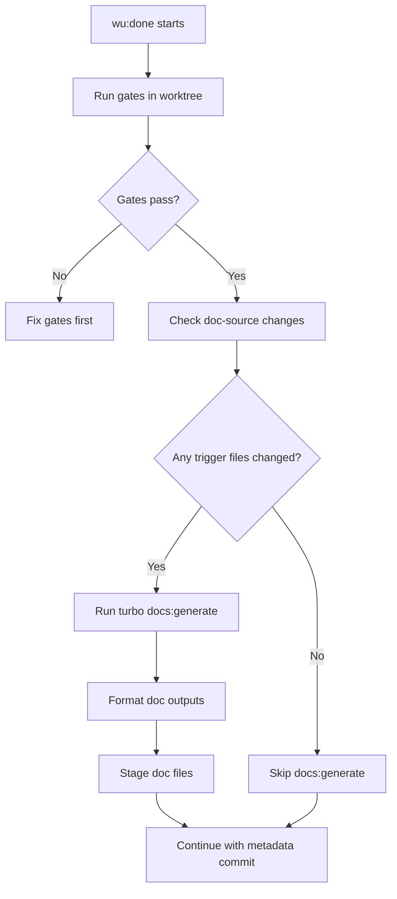

# Automatic CLI/Config Documentation Generation

**Last updated:** 2026-01-29

This document explains LumenFlow's automatic documentation generation system, which keeps Starlight docs in sync with code using a single-source-of-truth pattern.

---

## Overview

LumenFlow automatically generates CLI and configuration reference documentation from source code. This ensures documentation never drifts from implementation.

| Component        | Source                                                    | Output                                            |
| ---------------- | --------------------------------------------------------- | ------------------------------------------------- |
| CLI Reference    | `packages/@lumenflow/cli/src/**`                          | `apps/docs/src/content/docs/reference/cli.mdx`    |
| Config Reference | `packages/@lumenflow/core/src/lumenflow-config-schema.ts` | `apps/docs/src/content/docs/reference/config.mdx` |
| MCP Reference    | `packages/@lumenflow/mcp/src/tools.ts`                    | `apps/docs/src/content/docs/reference/mcp.mdx`    |

## Example Tagging Conventions

Docs example parity now distinguishes between copy-paste workflow examples and illustrative
snippets:

- `<!-- lumenflow-example: strict -->` marks a code block as a copy-paste example. Use this when
  the block is intended to reflect the current command surface and full workflow ordering.
- `<!-- lumenflow-example: illustrative -->` marks a block as explanatory only. It is still
  scanned for obvious command drift where practical, but it is excluded from strict workflow checks
  such as `wu:claim` → `wu:brief` → `wu:prep` → `wu:done`.
- `<!-- lumenflow-example: historical -->`, `legacy`, and `placeholder` are reserved for
  compatibility, migration, or incomplete examples that intentionally do not match the current
  live command surface.
- Strict CLI shell examples are additionally validated against the live `pnpm <command> --help`
  surface for each referenced public command. Unknown flags, retired option names, and missing
  required option values fail docs parity.
- Strict YAML and JSON config examples are additionally validated against the live configuration
  schemas. Unknown keys, invalid shapes, and stale config forms fail docs parity.
- Strict MCP JSON payload examples with `"name"` and `"arguments"` are additionally validated
  against the live MCP registry and the target tool's input schema. Required fields, enum values,
  and payload shapes must all remain valid.

Place the comment immediately above the fenced code block it applies to:

````md
<!-- lumenflow-example: illustrative -->

```bash
pnpm wu:status --id WU-123
```
````

If no tag is present, shell code blocks are treated as illustrative by default. Add a `strict` tag
whenever readers are expected to copy-paste a current workflow or command sequence.

For strict CLI examples, prefer complete commands that reflect the live flag surface:

````md
<!-- lumenflow-example: strict -->

```bash
pnpm wu:create --lane "Framework: Core" --title "Add feature" \
  --description "Context: ... Problem: ... Solution: ..." \
  --acceptance "Criterion 1" \
  --code-paths "src/file.ts" \
  --test-paths-unit "src/__tests__/file.test.ts" \
  --exposure backend-only
```
````

For strict config examples, prefer a real schema-backed snippet instead of pseudocode:

````md
<!-- lumenflow-example: strict -->

```yaml
software_delivery:
  gates:
    minCoverage: 90
```
````

For MCP payload examples, prefer:

````md
<!-- lumenflow-example: strict -->

```json
{
  "name": "wu_status",
  "arguments": {
    "id": "WU-1234"
  }
}
```
````

Use `illustrative` when a payload is intentionally partial or schematic and should not be enforced
against the full schema.

---

## Single-Source-of-Truth Pattern

The documentation generator imports directly from built packages rather than parsing source files with regex:

```typescript
// tools/generate-cli-docs.ts
import {
  WU_OPTIONS,
  DirectoriesSchema,
  GatesConfigSchema,
  // ... other schemas
} from '../packages/@lumenflow/core/dist/index.js';
```

**Benefits:**

- **No regex parsing**: Uses proper TypeScript imports
- **Type safety**: Schemas validate at build time
- **Consistent**: Same definitions used by CLI and docs
- **Maintainable**: Update code once, docs follow automatically

---

## Trigger Files

Changes to these files trigger documentation regeneration:

| File/Directory                                            | Description                           |
| --------------------------------------------------------- | ------------------------------------- |
| `tools/generate-cli-docs.ts`                              | The generator script itself           |
| `packages/@lumenflow/core/src/arg-parser.ts`              | CLI argument definitions (WU_OPTIONS) |
| `packages/@lumenflow/core/src/lumenflow-config-schema.ts` | Config schema definitions             |
| `packages/@lumenflow/core/src/index.ts`                   | Core exports                          |
| `packages/@lumenflow/cli/package.json`                    | CLI bin entries                       |
| `packages/@lumenflow/cli/src/**`                          | All CLI command sources               |

These pathspecs are defined in `DOC_SOURCE_PATHSPECS` within `packages/@lumenflow/core/src/wu-done-docs-generate.ts`.

---

## wu:done Auto-Detection Flow

When you run `pnpm wu:done`, the system automatically detects if docs need regeneration:



### Detection Logic

The detection uses efficient `git diff` with pathspecs:

```bash
git diff main...HEAD --name-only -- <pathspecs>
```

- **Zero overhead** when no doc-source files changed (~0ms)
- **Turbo caching** when docs:generate runs (incremental builds)

### Integration Point

In `executeWorktreeCompletion()` (after gates pass, before metadata commit):

```typescript
await maybeRegenerateAndStageDocs({
  baseBranch: 'main',
  repoRoot: repoRoot,
});
```

This ensures regenerated docs are included in the single atomic completion commit.

---

## Manual Commands

### Generate Documentation

Regenerate all CLI/config documentation:

```bash
pnpm docs:generate
```

This runs `tools/generate-cli-docs.ts` which:

1. Extracts command metadata from CLI package.json bin entries
2. Imports WU_OPTIONS from `@lumenflow/core` for option definitions
3. Extracts config schemas using Zod 4's native `toJSONSchema()`
4. Reads the built MCP tool registry from `packages/@lumenflow/mcp/dist/tools.js`
5. Generates MDX files with tables and code blocks
6. Formats output with Prettier

### Validate Documentation

Check if documentation is in sync with code (useful for CI):

```bash
pnpm docs:validate
```

- **Exit 0**: Documentation is up to date
- **Exit 1**: Documentation drift detected, run `pnpm docs:generate`

### Turbo Integration

The generator is integrated into Turbo for caching:

```json
// turbo.json
"docs:generate": {
  "dependsOn": ["@lumenflow/core#build"],
  "inputs": [
    "tools/generate-cli-docs.ts",
    "packages/@lumenflow/core/src/arg-parser.ts",
    "packages/@lumenflow/core/src/lumenflow-config-schema.ts",
    "packages/@lumenflow/core/src/index.ts",
    "packages/@lumenflow/cli/src/**/*.ts",
    "packages/@lumenflow/cli/package.json"
  ],
  "outputs": [
    "apps/docs/src/content/docs/reference/cli.mdx",
    "apps/docs/src/content/docs/reference/config.mdx",
    "apps/docs/src/content/docs/reference/mcp.mdx"
  ]
}
```

**Key points:**

- Depends on `@lumenflow/core#build` (requires built packages for imports)
- Inputs match `DOC_SOURCE_PATHSPECS` for consistent detection
- Outputs are cached; unchanged inputs skip regeneration

---

## Output Files

The generator produces three MDX files:

### CLI Reference (`cli.mdx`)

- Generated from CLI package.json bin entries
- Options extracted from WU_OPTIONS in `@lumenflow/core`
- Grouped by category (Work Units, Memory Layer, Initiatives, etc.)
- Includes required/optional flags and descriptions

### Config Reference (`config.mdx`)

- Generated from Zod schemas in `@lumenflow/core`
- Each config section documented with fields, types, defaults
- Environment variable overrides documented
- Validation command shown

### MCP Reference (`mcp.mdx`)

- Generated from the live MCP tool registry in `packages/@lumenflow/mcp/src/tools.ts`
- Category counts derived from the registered tool set at generation time
- Per-tool headings and input parameter tables generated from tool schemas
- Validation fails if the committed MCP reference drifts from the registry

---

## Adding New CLI Commands

When you add a new CLI command:

1. **Add bin entry** to `packages/@lumenflow/cli/package.json`
2. **Add options** to `WU_OPTIONS` in `packages/@lumenflow/core/src/arg-parser.ts`
3. **Run** `pnpm docs:generate` to update documentation
4. **Verify** the command appears in `cli.mdx`

The generator automatically:

- Discovers the new command from package.json
- Extracts options from WU_OPTIONS references in source
- Categorizes based on command prefix (wu-, mem-, etc.)

---

## Adding New Config Options

When you add new configuration options:

1. **Add to schema** in `packages/@lumenflow/core/src/lumenflow-config-schema.ts`
2. **Export** from `packages/@lumenflow/core/src/index.ts`
3. **Add to SCHEMA_DEFINITIONS** in `tools/generate-cli-docs.ts`
4. **Run** `pnpm docs:generate` to update documentation

---

## Troubleshooting

### Documentation Drift in CI

If CI fails with documentation drift:

```bash
# Regenerate and commit
pnpm docs:generate
git add apps/docs/src/content/docs/reference/
git commit -m "docs: regenerate CLI/config reference"
```

### Import Errors in Generator

If `tools/generate-cli-docs.ts` fails with import errors:

```bash
# Ensure packages are built
pnpm build
# Then regenerate
pnpm docs:generate
```

### Turbo Cache Issues

If docs aren't regenerating when they should:

```bash
# Clear Turbo cache and regenerate
pnpm clean
pnpm build
pnpm docs:generate
```

---

## Architecture Summary

```
Source Code                    Generator                      Output
────────────────────────────────────────────────────────────────────────
@lumenflow/core
  └── arg-parser.ts      ─┐
  └── lumenflow-config-  ─┼── tools/generate-cli-docs.ts ──┬─► cli.mdx
      schema.ts          ─┤       (imports from dist/)      │
@lumenflow/cli             │                                  │
  └── package.json       ─┤                                  └─► config.mdx
  └── src/**/*.ts        ─┘
```

**Key design decisions:**

- **Library imports over regex**: Reliable, type-safe extraction
- **Turbo integration**: Caching, dependency management
- **wu:done integration**: Zero-effort doc updates
- **CI validation**: Drift detection prevents stale docs

---

## Related Documentation

- [Release Process](./release-process.md) - Deployment workflow including docs
- [LumenFlow Agent Capsule](../../lumenflow-agent-capsule.md) - Full framework reference
- [Quick Reference Commands](./quick-ref-commands.md) - Command cheat sheet
